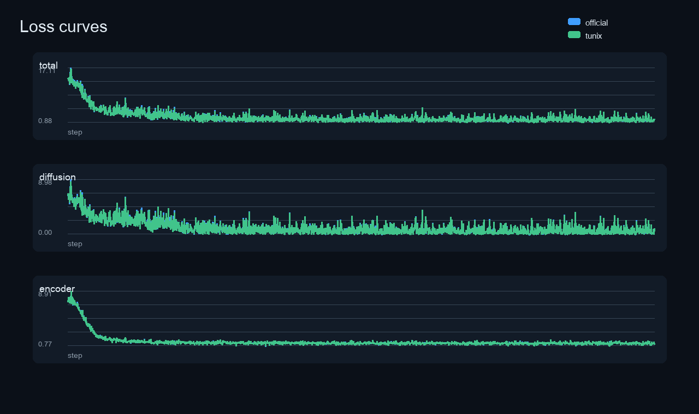
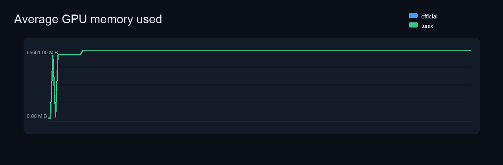

# DiffusionGemma H100x2 Three-Hour Comparison

This report compares the official DeepMind DiffusionGemma Hackable Diffusion training path with the Tunix wrapper path under matched H100x2 conditions.

## Verdict

Both matched H100x2 runs completed all 2000 steps successfully with finite losses and near-identical memory behavior. The Tunix wrapper path is ready for the validated official-backend PubMedQA LoRA workflow; it remains an official Hackable Diffusion backend wrapper rather than a fully native NNX/Qwix replacement.

## Run Matrix

| Run | State | Exit | Timed out | Steps | Total first | Total last | Total last-50 mean | Peak used MiB | Min free MiB | GPU util mean |
| --- | --- | ---: | --- | ---: | ---: | ---: | ---: | ---: | ---: | ---: |
| official | - | - | no | 2000 | 13.9219 | 2.0742 | 1.8728 | 65661.0 | 15419.0 | 90.744 |
| tunix | - | - | no | 2000 | 13.9219 | 2.0996 | 1.8734 | 65659.0 | 15421.0 | 91 |

JarvisLabs run status was checked separately because the local analyzer consumed copied logs rather than the local `jl` run database:

- Official reference: `r_5c5a20f2` on machine `426095`, exit `0`, succeeded.
- Tunix wrapper: `r_014dadd5` on machine `425962`, exit `0`, succeeded.

The final total-loss delta is `0.025390625` (`~1.22%` of the official final total loss). The last-50 total-loss means differ by `0.000556640625`.

## Loss Detail

| Run | Metric | Count | First | Last | First-50 mean | Last-50 mean | Min | Max | Finite |
| --- | --- | ---: | ---: | ---: | ---: | ---: | ---: | ---: | --- |
| official | losses/total | 2000 | 13.9219 | 2.0742 | 12.7136 | 1.8728 | 0.8784 | 17.1094 | yes |
| official | losses/diffusion_loss | 2000 | 6.6719 | 1.0352 | 5.7311 | 0.6756 | 0.0024 | 8.9844 | yes |
| official | losses/encoder_loss | 2000 | 7.25 | 1.0391 | 6.9825 | 1.1972 | 0.7695 | 8.9062 | yes |
| tunix | losses/total | 2000 | 13.9219 | 2.0996 | 12.6331 | 1.8734 | 0.8838 | 16.7656 | yes |
| tunix | losses/diffusion_loss | 2000 | 6.6719 | 1.0527 | 5.6863 | 0.6769 | 0.0034 | 8.5781 | yes |
| tunix | losses/encoder_loss | 2000 | 7.25 | 1.0469 | 6.9469 | 1.1965 | 0.7754 | 8.875 | yes |

## Environment

| Field | Official | Tunix wrapper | Match |
| --- | --- | --- | --- |
| `gemma_revision` | `a7e33454206ca24984565992f5c903191baecc22` | `a7e33454206ca24984565992f5c903191baecc22` | yes |
| `hackable_diffusion_revision` | `03ce88ed0acec3b17f4f284502a6053c5f2b3a15` | `03ce88ed0acec3b17f4f284502a6053c5f2b3a15` | yes |
| `jax_package_spec` | `jax[cuda13]==0.10.1` | `jax[cuda13]==0.10.1` | yes |
| `train_loop` | `hybrid` | `hybrid` | yes |
| `sync_after_step` | `losses` | `losses` | yes |

## Artifact Inventory

| Artifact | Official | Tunix wrapper |
| --- | ---: | ---: |
| `checkpoint_inventory.txt` | missing | missing |
| `gpu_memory.csv` | 12974 B | 13133 B |
| `hybrid_loop_progress.json` | missing | missing |
| `hybrid_loop_start.json` | missing | missing |
| `hybrid_loop_state.json` | missing | missing |
| `job_result.json` | 910 B | 891 B |
| `run_summary.json` | 8376 B | 7144 B |
| `train.log` | 1774189 B | 1769844 B |

## Plots

## Notes

- The two long runs are independent stochastic training runs. Exact step-by-step loss identity is not expected; parity of deterministic helper paths and logits is covered by the dedicated parity scripts in `scripts/verify_diffusion_gemma_official_parity.py` and `scripts/verify_diffusion_gemma_official_logits.py`.
- The Tunix path intentionally wraps the official Hackable Diffusion backend for the GPU-heavy model/loss path, while exposing a Tunix-facing integration layer. This avoids reimplementing the fragile multi-GPU diffusion internals before a full NNX/Qwix port.
- CUDA VMM/TensorFlow GPU visibility warnings were counted when present. They are treated as non-fatal only when the training process reaches finite losses and exits with code 0.

## Warning Counts

| Pattern | Official | Tunix wrapper |
| --- | ---: | ---: |
| `CUDA_ERROR_NOT_PERMITTED` | 2648 | 2648 |
| `TF-TRT Warning` | 0 | 0 |
| `Unable to register` | 0 | 0 |
| `Could not find cuda drivers` | 0 | 0 |
| `NCCL` | 0 | 0 |
| `Traceback` | 0 | 0 |
| `RuntimeError` | 0 | 0 |
| `OutOfMemory` | 0 | 0 |
| `RESOURCE_EXHAUSTED` | 0 | 0 |
| `nan` | 0 | 0 |
