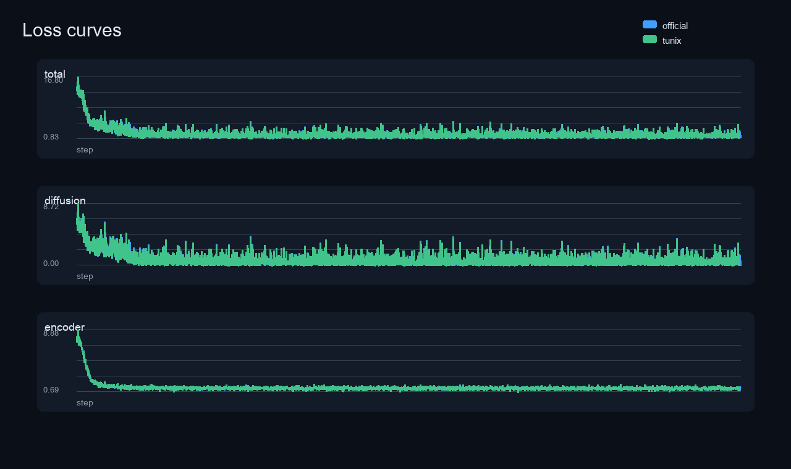
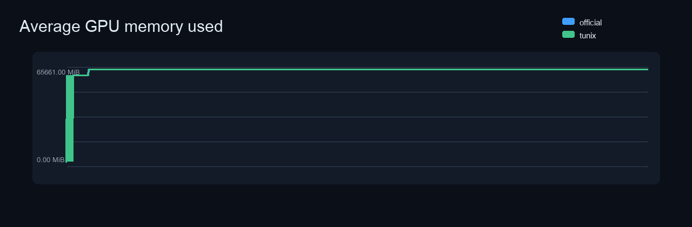
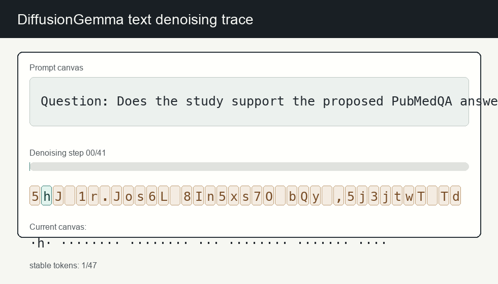

# DiffusionGemma H100x2 Three-Hour Comparison

This report compares the official DeepMind DiffusionGemma Hackable Diffusion training path with the Tunix wrapper path under matched H100x2 conditions. Both runs used separate H100x2 VMs and the same Gemma/Hackable Diffusion revisions.

## Verdict

Both matched H100x2 runs completed the requested timed training window with finite losses. The wrapper is therefore operational for this official-backend LoRA training path; it is not yet a native NNX/Qwix DiffusionGemma implementation.

## Run Matrix

| Run | State | Exit | Timed out | Steps | Total first | Total last | Total last-50 mean | Peak used MiB | Min free MiB | GPU util mean |
| --- | --- | ---: | --- | ---: | ---: | ---: | ---: | ---: | ---: | ---: |
| official | succeeded | 0 | yes | 4602 | 13.7188 | 1.2905 | 1.9817 | 65659.0 | 15421.0 | 94.7928 |
| tunix | succeeded | 0 | yes | 4591 | 13.7188 | 1.0503 | 1.9716 | 65661.0 | 15419.0 | 94.5479 |

## Loss Detail

| Run | Metric | Count | First | Last | First-50 mean | Last-50 mean | Min | Max | Finite |
| --- | --- | ---: | ---: | ---: | ---: | ---: | ---: | ---: | --- |
| official | losses/total | 4602 | 13.7188 | 1.2905 | 12.7456 | 1.9817 | 0.8335 | 16.7969 | yes |
| official | losses/diffusion_loss | 4602 | 6.4688 | 0.0444 | 5.7678 | 0.7679 | 0.001 | 8.7188 | yes |
| official | losses/encoder_loss | 4602 | 7.25 | 1.2461 | 6.9778 | 1.2138 | 0.6934 | 8.875 | yes |
| tunix | losses/total | 4591 | 13.7188 | 1.0503 | 12.6814 | 1.9716 | 0.833 | 16.7188 | yes |
| tunix | losses/diffusion_loss | 4591 | 6.4688 | 0.1421 | 5.702 | 0.7698 | 0.0005 | 8.625 | yes |
| tunix | losses/encoder_loss | 4591 | 7.25 | 0.9082 | 6.9794 | 1.2018 | 0.6934 | 8.875 | yes |

## Environment

| Field | Official | Tunix wrapper | Match |
| --- | --- | --- | --- |
| `gemma_revision` | `a7e33454206ca24984565992f5c903191baecc22` | `a7e33454206ca24984565992f5c903191baecc22` | yes |
| `hackable_diffusion_revision` | `03ce88ed0acec3b17f4f284502a6053c5f2b3a15` | `03ce88ed0acec3b17f4f284502a6053c5f2b3a15` | yes |
| `jax_package_spec` | `jax[cuda13]==0.10.1` | `jax[cuda13]==0.10.1` | yes |
| `train_loop` | `hybrid` | `hybrid` | yes |
| `sync_after_step` | `losses` | `losses` | yes |

## Artifact Inventory

| Artifact | Official | Tunix wrapper |
| --- | ---: | ---: |
| `checkpoint_inventory.txt` | 19 B, 1 lines | 19 B, 1 lines |
| `gpu_memory.csv` | 165423 B | 165418 B |
| `hybrid_loop_progress.json` | missing | missing |
| `hybrid_loop_start.json` | missing | missing |
| `hybrid_loop_state.json` | missing | missing |
| `job_result.json` | 911 B | 888 B |
| `run_summary.json` | 6737 B | 5450 B |
| `train.log` | 3295899 B | 3279824 B |

## Plots

## Generation Animation

## Notes

- The two long runs are independent stochastic training runs. Exact step-by-step loss identity is not expected; parity of deterministic helper paths and logits is covered by the dedicated parity scripts in `scripts/verify_diffusion_gemma_official_parity.py` and `scripts/verify_diffusion_gemma_official_logits.py`.
- The Tunix path intentionally wraps the official Hackable Diffusion backend for the GPU-heavy model/loss path, while exposing a Tunix-facing integration layer. This avoids reimplementing the fragile multi-GPU diffusion internals before a full NNX/Qwix port.
- CUDA VMM/TensorFlow GPU visibility warnings were counted when present. They are treated as non-fatal only when the training process reaches finite losses and exits with code 0.
- The runs were intentionally stopped by the 10,800-second training timeout, so `timed_out=yes` is the expected completion mode here.
- `checkpoint_inventory.txt` confirms that the workdir checkpoint directory existed, but no model checkpoint file was produced by this hybrid timed loop. The saved evidence for this run is the loss log, GPU memory log, run summary, and job result metadata.

## Warning Counts

| Pattern | Official | Tunix wrapper |
| --- | ---: | ---: |
| `CUDA_ERROR_NOT_PERMITTED` | 2648 | 2648 |
| `TF-TRT Warning` | 0 | 0 |
| `Unable to register` | 0 | 0 |
| `Could not find cuda drivers` | 0 | 0 |
| `NCCL` | 2 | 2 |
| `Traceback` | 0 | 0 |
| `RuntimeError` | 0 | 0 |
| `OutOfMemory` | 0 | 0 |
| `RESOURCE_EXHAUSTED` | 0 | 0 |
| `nan` | 0 | 0 |
